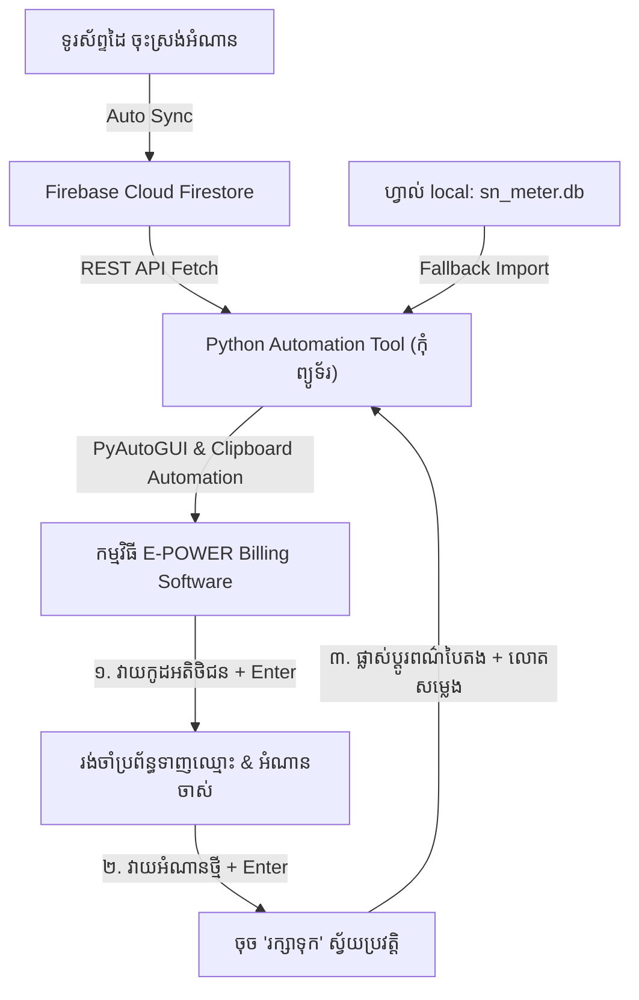

# ផែនការអនុវត្ត៖ កម្មវិធីស្វ័យប្រវត្តបញ្ចូលទិន្នន័យពី Firebase Cloud ទៅក្នុងប្រព័ន្ធអគ្គិសនី E-POWER (Python Automation)

ផែនការនេះបង្កើតនូវកម្មវិធីកុំព្យូទ័រ **E-POWER Auto Sync & Entry Tool** ដោយប្រើប្រាស់ Python, Tkinter, PyAutoGUI និង Firebase REST API ដើម្បីទាញយកលេខអំណានដែលបាន Sync ពីទូរស័ព្ទដៃ រួចបញ្ជាបញ្ចូលទៅក្នុងកម្មវិធីគ្រប់គ្រងអគ្គិសនី **E-POWER** ដោយស្វ័យប្រវត្តិ។

---

## 🎯 គោលបំណង និងលំហូរការងារ (Workflow)

---

## 🛠️ សមាសភាគដែលត្រូវអភិវឌ្ឍ (Proposed Changes)

### 1. កម្មវិធី Python ស្នូល (`automation/epower_auto_sync.py`)

បង្កើតកម្មវិធី GUI លើកុំព្យូទ័រដែលមានមុខងារដូចខាងក្រោម៖
* **Firebase Data Fetcher:** ទាញយកបញ្ជីអតិថិជន និងលេខអំណានកុងទ័រថ្មីៗពី Firebase Firestore Project `meter-reading-654c0` ដោយស្វ័យប្រវត្តិ តាមរយៈ Firestore REST API (មិនបាច់ដំឡើង SDK ស្មុគស្មាញឡើយ)។
* **SQLite Fallback Import:** អាចជ្រើសរើសទាញយកទិន្នន័យពីហ្វាល់ `sn_meter.db` ដោយផ្ទាល់ ករណីគ្មាន អ៊ីនធឺណិត។
* **Smart Keyboard Automation Engine:**
  - **ជំហានទី ១ (កូដអតិថិជន)៖** វាយបញ្ចូល `Customer Code` រួច press `Enter` ➔ រង់ចាំកម្មវិធី E-POWER ដំណើរការ ( Configurable Delay ឧទាហរណ៍ 1.2 វិនាទី)។
  - **ជំហានទី ២ (អំណានថ្មី)៖** វាយបញ្ចូល `New Reading` (សម្អាតសញ្ញាក្បៀស `,` ចោល) រួច press `Enter` ឬចុចប៊ូតុង "រក្សាទុក"។
  - **Khmer Clipboard Support (`pyperclip`):** ប្រើប្រាស់ប្រព័ន្ធ Copy-Paste ជំនួសការវាយ Direct លើ Keyboard ដើម្បីការពារការច្រឡំអក្សរខ្មែរ ឬនិមិត្តសញ្ញាពិសេស។
  - **Failsafe & Control:** មានជម្រើស **Dry Run** (តេស្តមើលដោយមិនវាយបញ្ចូលពិត), **Interval Speed Slider** (សារ៉េល្បឿនរង់ចាំ), ប៊ូតុង **Start/Pause/Stop**, និងការបិទស្វ័យប្រវត្តិពេល Mouse រកិលទៅកៀនអេក្រង់ (FailsafeException)។

### 2. ហ្វាល់ដំឡើង និង ដំណើរការ (Installation & Launcher)

* `automation/requirements.txt`: បញ្ជី library ត្រូវការ (`pyautogui`, `pyperclip`, `requests`).
* `automation/run_automation.bat`: ហ្វាល់ Batch សម្រាប់ចុច 1-Click ដើម្បី Run កម្មវិធីលើ Windows។

---

## 📂 ការផ្លាស់ប្ដូរឯកសារ (Files to Create)

#### [NEW] [`epower_auto_sync.py`](file:///c:/Project/flutter_application/automation/epower_auto_sync.py)
កូដកម្មវិធី Python GUI ពេញលេញ សម្រាប់ការទាញទិន្នន័យពី Firebase និងបញ្ចូលទៅ E-POWER។

#### [NEW] [`requirements.txt`](file:///c:/Project/flutter_application/automation/requirements.txt)
បញ្ជីបណ្ណាល័យជំនួយសម្រាប់ Python (PyAutoGUI, PyperClip, Requests)។

#### [NEW] [`run_automation.bat`](file:///c:/Project/flutter_application/automation/run_automation.bat)
ហ្វាល់ Launch 1-Click សម្រាប់ Windows។

---

## 🧪 ផែនការធ្វើតេស្ត និងផ្ទៀងផ្ទាត់ (Verification Plan)

### Manual Verification
1. **តេស្ត Fetch ទិន្នន័យ៖** បើកកម្មវិធី Python រួចចុចប៊ូតុង **"ទាញយកទិន្នន័យពី Firebase Cloud"** ផ្ទៀងផ្ទាត់ថាបញ្ជីអតិថិជន និងលេខអំណានថ្មីៗលេចឡើងក្នុងតារាង។
2. **តេស្ត Dry Run Mode៖** ចុចគ្រវីលើប្រអប់ **Dry Run (សាកល្បង)** រួចចុច **"ចាប់ផ្ដើម"** ដើម្បីផ្ទៀងផ្ទាត់ថាប្រព័ន្ធដំណើរការរត់តាមជួរ និងដូរពណ៌បៃតងបានត្រឹមត្រូវដោយមិនប៉ះពាល់កម្មវិធី E-POWER ឡើយ។
3. **តេស្ត Real Entry សាកល្បង៖** បើកផ្ទាំង "បញ្ចូលការប្រើប្រាស់" ក្នុង E-POWER រួចចុច **"ចាប់ផ្ដើម"** លើ Python Tool ដើម្បីផ្ទៀងផ្ទាត់ការវាយលេខកូដ និងអំណានថ្មីចូល E-POWER យ៉ាងរលូន។
