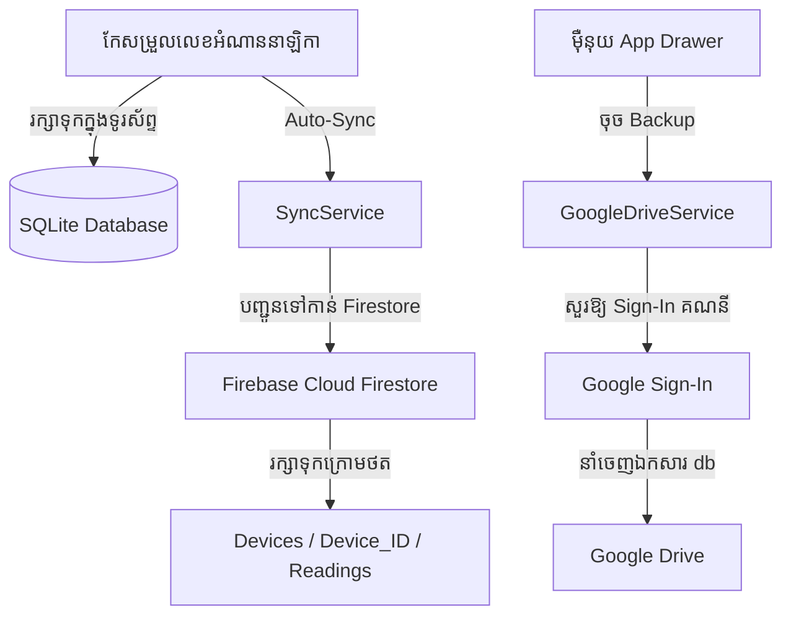

# ផែនការអនុវត្ត៖ ប្រព័ន្ធការពារ និងរក្សាទុកទិន្នន័យស្វ័យប្រវត្តលើ Cloud (Google Drive & Firebase Sync)

ផែនការនេះមានគោលបំណងបង្កើតផ្លូវការពារ និងបង្ការការបាត់បង់ទិន្នន័យ នៅពេលទូរស័ព្ទរបស់អ្នកស្រង់ជួបប្រទះការខូចខាតកំឡុងពេលចុះបំពេញការងារ ដោយបញ្ចូល៖
1. **Google Drive Backup:** ការចម្លង និងរក្សាទុកឯកសារ Database (`sn_meter.db`) ទៅកាន់ Google Drive ផ្ទាល់ខ្លួនរបស់ឧបករណ៍នីមួយៗ តាមរយៈការចូលប្រព័ន្ធ (Sign-In) ដោយគណនី Google (Email) ពេលបើកកម្មវិធីលើកដំបូង។
2. **Firebase Auto Sync (Real-time):** បង្កើតប្រព័ន្ធបញ្ជូនទិន្នន័យស្វ័យប្រវត្តភ្លាមៗ (Auto Sync) ទៅកាន់ Firebase Firestore រាល់ពេលរក្សាទុកលេខអំណានកុងទ័រនីមួយៗ ដោយកំណត់សម្គាល់តាមរយៈអត្តសញ្ញាណឧបករណ៍ (Device ID/UUID)។

---

## 📦 កញ្ចប់កម្មវិធីដែលត្រូវបន្ថែម (Dependencies to Add)

យើងត្រូវបន្ថែមបណ្ណាល័យសំខាន់ៗខាងក្រោមទៅក្នុង `pubspec.yaml`៖
- **`firebase_core`:** សម្រាប់ដំណើរការ និងការចាប់ផ្តើមសេវាកម្ម Firebase។
- **`cloud_firestore`:** សម្រាប់រក្សាទិន្នន័យ និងស្របគ្នាក្នុងពេលជាក់ស្តែង (Real-time Database Sync)។
- **`google_sign_in`:** សម្រាប់សេវាកម្មចុះឈ្មោះចូលប្រើគណនី Google (Google Account Sign-In)។
- **`googleapis` & `googleapis_auth`:** សម្រាប់ធ្វើការជាមួយ Google Drive API ក្នុងការទាញយក និងរក្សាទុកឯកសារ។
- **`device_info_plus`:** សម្រាប់ចាប់យកព័ត៌មាន និងលេខសម្គាល់ឧបករណ៍ (Device ID/Name)។
- **`extension_google_sign_in_as_googleapis_auth`:** សេវាកម្មជំនួយដើម្បីបំប្លែង Google Sign-In Client ទៅជា Auth Client សម្រាប់ Google Drive API។

---

## 🛠️ ស្ថាបត្យកម្ម និងលំហូរការងារ (Architecture & Workflow)

---

## 📂 ឯកសារដែលត្រូវកែប្រែ និងបង្កើតថ្មី (Proposed Changes)

### [Component: Services]

#### [NEW] [sync_service.dart](file:///c:/Project/flutter_application/lib/services/sync_service.dart)
- គ្រប់គ្រងលើការតភ្ជាប់ និងបញ្ជូនទិន្នន័យទៅកាន់ Firebase Firestore។
- ចាប់យកលេខសម្គាល់ឧបករណ៍ (Device ID) តាមរយៈ `device_info_plus`។
- មុខងារ `syncReading(String customerCode, double newValue)` ដើម្បីបញ្ជូនទិន្នន័យទៅកាន់ Firestore ភ្លាមៗ (Auto Sync) រាល់ពេលចុច Save។

#### [NEW] [google_drive_service.dart](file:///c:/Project/flutter_application/lib/services/google_drive_service.dart)
- គ្រប់គ្រងការ Sign-In គណនី Google និងការអនុញ្ញាតសិទ្ធិ Google Drive scope (`drive.file`)។
- មុខងារ `uploadDatabaseToDrive()` ដើម្បីបង្កើត Folder ឈ្មោះ `SN_Meter_Backups` និងបញ្ចូលឯកសារ `sn_meter.db` ទៅកាន់ Drive ស្វ័យប្រវត្ត ឬដោយដៃ។

#### [MODIFY] [database_service.dart](file:///c:/Project/flutter_application/lib/database_service.dart)
- កែសម្រួលមុខងារ `updateReading` ដើម្បីហៅទៅកាន់ `SyncService().syncReading(...)` ក្នុង Background រាល់ពេលរក្សាទុកទិន្នន័យបានជោគជ័យ។

---

### [Component: Screens & UI]

#### [NEW] [backup_sync_screen.dart](file:///c:/Project/flutter_application/lib/screens/backup_sync_screen.dart)
- ផ្ទាំងគ្រប់គ្រង Cloud Backup ស្រស់ស្អាត៖
  - ប៊ូតុង Sign-In / Sign-Out គណនី Google។
  - បង្ហាញព័ត៌មានគណនី និងស្ថានភាពការតភ្ជាប់ Firebase (Connected/Disconnected)។
  - បង្ហាញលេខសម្គាល់ឧបករណ៍ (Device ID)។
  - ប៊ូតុងបញ្ជូនទិន្នន័យទៅកាន់ Google Drive ដោយដៃ (Manual Backup Now) និងជម្រើស Auto-Backup។

#### [MODIFY] [app_drawer.dart](file:///c:/Project/flutter_application/lib/widgets/app_drawer.dart)
- បន្ថែមប៊ូតុងម៉ឺនុយ **"រក្សាទុកលើ Cloud (Cloud Sync)"** ដើម្បីបើកផ្ទាំង `BackupSyncScreen`។

#### [MODIFY] [main.dart](file:///c:/Project/flutter_application/lib/main.dart)
- ចាប់ផ្តើមដំណើរការ `Firebase.initializeApp()` នៅក្នុង `main()` មុនពេលបើកអេក្រង់ដំបូង។

---

## ⚠️ ព័ត៌មានសំខាន់សម្រាប់អ្នកប្រើប្រាស់ (Developer/User Configuration Required)

> [!IMPORTANT]
> ដោយសារការភ្ជាប់ទៅកាន់ Google Cloud និង Firebase ត្រូវការការកំណត់អត្តសញ្ញាណគម្រោង (Project API Keys/Credentials) បងត្រូវ៖
> 1. បង្កើតគម្រោងនៅលើ **Firebase Console** និងទាញយកឯកសារកម្រិតទាប៖
>    - សម្រាប់ Android៖ `google-services.json` (ដាក់ក្នុង `android/app/`)
>    - សម្រាប់ iOS៖ `GoogleService-Info.plist` (ដាក់ក្នុង `ios/Runner/`)
> 2. បើកដំណើរការ **Google Drive API** នៅក្នុង **Google Cloud Console** និងបង្កើត OAuth 2.0 Client ID សម្រាប់ iOS និង Android។
> 3. កូដដែលខ្ញុំនឹងសរសេរ គឺរៀបចំទម្រង់ស្រាប់ដើម្បីគាំទ្រឯកសារ និងការកំណត់ទាំងនេះទាំងអស់។

---

## ផែនការផ្ទៀងផ្ទាត់ (Verification Plan)

### ការធ្វើតេស្តដោយដៃ (Manual Verification)
1. បើកកម្មវិធី និងពិនិត្យផ្ទាំងដំបូង ឬម៉ឺនុយ "Cloud Sync"។
2. សាកល្បងចុចចូល Google Sign-In និងធានាថាវាដំណើរការ។
3. ធ្វើការផ្លាស់ប្តូរលេខអំណានកុងទ័រណាមួយ រួចពិនិត្យមើលថាតើទិន្នន័យត្រូវបានបញ្ជូនទៅកាន់ Firebase Firestore ក្រោម Device ID ជាក់ស្តែងដែរឬទេ។
4. ចុចប៊ូតុង "រក្សាទុកឯកសារ Database ទៅកាន់ Drive" រួចបើក Google Drive លើទូរស័ព្ទ ដើម្បីផ្ទៀងផ្ទាត់ថាតើមាន Folder `SN_Meter_Backups` និងឯកសារ `sn_meter.db` ដែរឬទេ។
